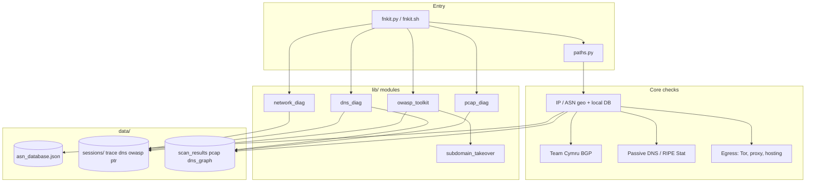

# FieldNet Kit (FNkit)

**Portable network intelligence from one terminal** — trust IP/ASN against your baseline, see BGP + passive DNS context, then drill into DNS graph, trace, PCAP, or OWASP checks without switching tools.

> *Ранее репозиторий: `ip_checker` · GitHub: [klavdiy/fieldnetkit](https://github.com/klavdiy/fieldnetkit)*

---

## 15-second pitch

You paste an IP from a firewall alert, ticket, or `kubectl get svc`. **FNkit answers in one pass:** does geo match the ASN you expect, who owns the prefix *right now* (BGP), was this IP on a Tor exit or a CDN yesterday (egress + passive DNS), and where is the abuse contact — before you open six browser tabs or guess from a `/8` in CMDB.

**FNkit за 15 секунд:** IP из алерта → совпадает ли страна с вашим ASN, живой BGP origin, не Tor/прокси ли egress, что было на адресе в passive DNS, куда писать по abuse — без зоопарка вкладок.

```bash
./fnkit.sh -i 203.0.113.45          # интерактивно + меню инструментов
python3 fnkit.py -i 8.8.8.8 -s      # CLI + отчёт в data/scan_results.json
```

---

## When FNkit saves the day

| Moment | Without FNkit | With FNkit |
|--------|---------------|------------|
| **SOC: страна «не та»** | Спор ip-api vs CMDB, ручной whois | Mismatch + quarantine: whois ≠ geo → **no false DB write**; BGP origin vs ваша база |
| **Incident: новый IP в логах** | «Это наш VPS или взлом?» | Egress: Tor/proxy/hosting + passive DNS: **кто ещё сидел на IP** |
| **AppSec: поддомен после утечки DNS** | Отдельно Amass, headers, takeover-чеклисты | Pipeline: headers → TLS → Amass → **dangling CNAME** (~50 fingerprints) |
| **SRE: «стало медленно»** | speedtest в браузере, trace в другом окне | Меню **4**: speed-test + **MTR-style trace** → JSON → replay позже |
| **Forensics: pcap на ноутбуке** | Wireshark + ручной DNS | PCAP → DNS crawl → **HTML-граф** в `data/dns_graph/` |

<details>
<summary><strong>Example: mismatch that would have polluted your ASN DB</strong></summary>

```text
Checking IP: 195.20.1.1
✗ MISMATCH: Expected RU | Actual DE
BGP origin: AS12389 — matches DB ASN, geo does not
⚠ Conflict quarantined: WHOIS and ip-api disagree. No DB write performed.
```

You keep investigating instead of auto-tagging the whole AS as «Germany».

</details>

---

## Architecture



**Layout:** `fnkit.py` at repo root · Python modules in `lib/` · databases, config, sessions under `data/` (legacy root paths migrate on first run).

---

## Why FNkit instead of …

| Need | Typical stack | FNkit |
|------|----------------|-------|
| «Whose IP is this?» | whois + ip-api in browser | One TUI/CLI: geo + **expected country from your DB** + mismatch/quarantine |
| Prefix truth | RIPEstat / bgp.tools | **Live Cymru origin** vs static pools; pools **≥ /20**, no false `/8` match |
| Historical context | VirusTotal, SecurityTrails tabs | **passive DNS** + optional API keys (menu 7) in same report |
| Attack surface | Amass + httpx + custom scripts | **OWASP pipeline**: headers (value checks), TLS, Amass, takeover |
| DNS cartography | dig loops, spreadsheets | **DNS graph** crawl, crt.sh, HTML export, resolver diff |
| Laptop forensics | Wireshark only | **PCAP capture/show** + DNS seeds from `tshark` |

FNkit is not a SaaS scanner replacement — it is a **field workbench** when you already have shell access and need defensible answers fast, offline-friendly where possible.

---

## Screenshots

> Add GIFs under `docs/assets/` and link them here (PRs welcome).

| Screen | File (planned) |
|--------|----------------|
| Egress banner + main menu | `docs/assets/menu-main.png` |
| IP mismatch + quarantine | `docs/assets/ip-mismatch.png` |
| Trace monitor (TTY) | `docs/assets/trace-monitor.gif` |
| DNS HTML graph | `docs/assets/dns-graph.png` |
| OWASP secure headers report | `docs/assets/owasp-headers.png` |

Until assets land, run locally:

```bash
./fnkit.sh    # menu + egress frame
python3 fnkit.py -i 1.1.1.1 --owasp-headers https://example.com
```

---

## Quick start

```bash
chmod +x fnkit.sh scripts/install-deps.sh
./scripts/install-deps.sh minimal    # Python, whois, ping
./fnkit.sh
```

```bash
python3 fnkit.py -h
python3 fnkit.py --check-deps --check-deps-hints
python3 fnkit.py -i 8.8.8.8
```

Windows: `.\scripts\install-deps.ps1 -Profile minimal` → `.\fnkit.ps1 -i 8.8.8.8`

Optional: `pip install -r requirements-dns.txt` (DNS menu), `requirements-optional.txt` (MaxMind / IP2Location).

---

## What you get (at a glance)

| Area | Highlights |
|------|------------|
| **Trust** | Local ASN DB, geo mismatch, auto-reclass with quarantine |
| **Context** | BGP origin, passive DNS, egress/NAT signals |
| **Diagnostics** | Speed-test, parallel hop monitor, PCAP |
| **DNS** | BFS crawl, crt.sh, resolver compare, vis-network HTML |
| **Security** | OWASP headers/TLS, Amass, subdomain takeover, WSTG links |
| **Ops** | `data/` layout, SBOM, CI validate, `--maintain-db` |

---

## Documentation

| Doc | Contents |
|-----|----------|
| **[docs/USER_GUIDE.md](docs/USER_GUIDE.md)** | Full manual: every menu item, CLI flags, JSON formats, troubleshooting |
| [docs/SBOM.md](docs/SBOM.md) | Dependencies, SBOM regeneration |
| [docs/OWASP_INTEGRATION.md](docs/OWASP_INTEGRATION.md) | OWASP pipeline, third-party tools |
| [docs/OWASP_THIRD_PARTY.md](docs/OWASP_THIRD_PARTY.md) | Licenses, authorized use |

---

## Project layout

```text
fnkit.py, fnkit.sh, fnkit.ps1, paths.py
lib/          network_diag, dns_diag, pcap_diag, owasp_toolkit, …
data/         asn_database.json, config/, sessions/, pcap/, cache/
scripts/      check_deps, validate_asn_db, install-deps
docs/         USER_GUIDE, SBOM, OWASP
```

---

## Community & license

- [Contributing](CONTRIBUTING.md) · [Code of Conduct](CODE_OF_CONDUCT.md) · [Security](.github/SECURITY.md)
- **License:** [MIT](LICENSE)

**Authorized use only** for targets you own or have permission to test (nmap, Amass, DNS brute, Nettacker).
